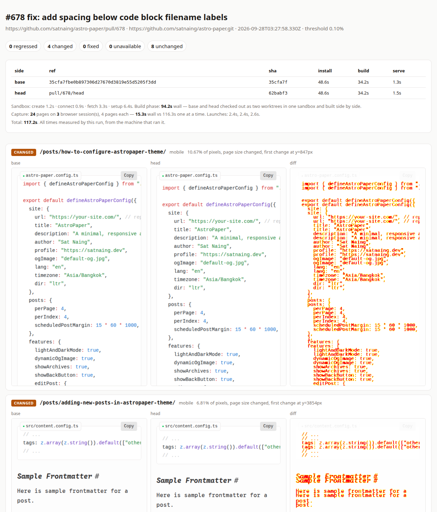

# pr-visual-diff (TypeScript)

**What does this pull request look like?** Point it at a GitHub PR and it builds
both sides in a Solari sandbox, screenshots every route × viewport of each in
Solari cloud browsers, and tells you which pages changed, which broke, and
where on the page to look.

Nothing builds or renders on your machine: no `npm install` of the target
repo, no local Chromium. Your laptop only orchestrates and diffs PNGs.



## Why

Plenty of PRs change what users see without anyone looking. Dependency bumps are
the classic case: a green CI run says the site *builds*, not that it *looks the
same*. A PR's own "before/after" screenshots cover the one page its author
thought of.

This checks every page you name, at every size you name, on both sides, the
same way each time. It also reports what a screenshot can't show: a page that
starts returning 404, or starts throwing errors in the console.

## Run

```bash
cd applications/pr-visual-diff
npm install
export SOLARI_API_KEY=slr_live_...   # https://console.getsolari.com

npm start -- --pr https://github.com/satnaing/astro-paper/pull/678 --node 22 \
  --route /,/posts/,/tags/,/about/ \
  --route /posts/how-to-configure-astropaper-theme/,/posts/adding-new-posts-in-astropaper-theme/
```

That's a real, open PR on a popular Astro theme. It adds spacing under code
block filename labels. Real output:

```
#678 fix: add spacing below code block filename labels

  CHANGED     mobile   /posts/how-to-configure-astropaper-theme/  — 10.67% of pixels, page size changed, first change at y=847px
  CHANGED     mobile   /posts/adding-new-posts-in-astropaper-theme/  — 6.81% of pixels, page size changed, first change at y=3854px
  CHANGED     desktop  /posts/how-to-configure-astropaper-theme/  — 6.12% of pixels, page size changed, first change at y=655px
  CHANGED     desktop  /posts/adding-new-posts-in-astropaper-theme/  — 3.41% of pixels, page size changed, first change at y=3256px

  0 regressed · 4 changed · 0 fixed · 0 unavailable · 8 unchanged  (12 route×viewport pairs)

  timing (measured by this run)
    sandbox create 1.2s · connect 0.9s · fetch 3.3s · setup 6.4s
    base    install 48.6s · build 34.2s · serve 1.3s
    head    install 48.6s · build 34.2s · serve 1.5s
    build phase wall 94.2s (base and head built side by side in one sandbox)
    capture: 24 pages on 3 browser session(s) × 4 pages each
      wall 15.3s vs 116.3s one at a time (7.6×)
      browser launch 2.4s, 2.4s, 2.6s
    total 117.2s

  report: out/2026-09-28T03-27-58-330Z/report.html
```

The two posts with filename-labelled code blocks changed. Every other page is
pixel-identical. The same command on
[#685](https://github.com/satnaing/astro-paper/pull/685), which bumps `astro`
from 7.0.3 to 7.2.8, reports all 14 pairs unchanged at exactly 0 pixels: a
dependency bump you can merge without opening a browser.

Any two refs work too, not just PRs:

```bash
npm start -- --repo owner/name --base main --head my-branch --route /,/pricing
```

`report.html` shows base, head, and diff for each pair, with regressions first.
Each image opens scrolled to the first changed row. `report.json` has the same
data for CI. The exit status is `1` when anything regressed, or when anything
changed if you pass `--fail-on-change`.

## How it works

```
                        ┌─────────────── one Solari sandbox ───────────────┐
  GitHub PR  ──fetch──▶ │ /work/base  install → build → serve :3000  ──────┼──▶ preview URL (base)
                        │ /work/head  install → build → serve :3001  ──────┼──▶ preview URL (head)
                        └──────────────────────────────────────────────────┘
                                                 │
            (base, head) × routes × viewports = N jobs on one shared queue
                                                 │
            ┌── browser session 1 ── 4 pages at a time, fresh context each
            ├── browser session 2 ── …
            └── browser session 3 ── …
                                                 │
            per pair: pixel diff + status + errors head has that base didn't
                                                 │
                           report.html · report.json · exit status
```

- **Build** ([`src/build.ts`](src/build.ts)): one sandbox. Both commits come
  down in one repo and are checked out as two `git worktree`s. The two sides
  then install, build, and serve at the same time, each on its own port with its
  own preview URL. Tool setup (`--node`, the static server) overlaps the fetch.
- **Capture** ([`src/capture.ts`](src/capture.ts)): a few browser sessions,
  each running several pages at once, each page in its own context with its own
  viewport. Animations are frozen and fonts awaited before the screenshot.
  Console errors, uncaught exceptions, and failed same-origin requests are
  recorded.
- **Judge** ([`src/compare.ts`](src/compare.ts)): *regressed* if head fails to
  load, returns ≥ 400, or logs errors base didn't. *changed* if the pixels
  differ past `--threshold`. Errors are compared with the preview host
  stripped, since base and head are served from different hosts.
- **Diff** ([`src/diff.ts`](src/diff.ts)): pixelmatch on the region both
  screenshots cover. Everything outside it counts as changed.

## Options

| Flag | Default | |
| --- | --- | --- |
| `--pr <url>` | | GitHub PR URL, or a number with `--repo` |
| `--repo`, `--base`, `--head` | | any two refs: branch, tag, SHA |
| `--route <path>` | `/` | repeatable, or comma-separated |
| `--viewport <name=WxH>` | `mobile=390x844`, `desktop=1280x800` | repeatable |
| `--mask <selector>` | | painted over before the screenshot: clocks, ads, avatars |
| `--node <version>` | image's Node 20 | install e.g. `22` or `22.12.0` first |
| `--setup <cmd>` | | runs once before both sides install |
| `--install <cmd>` | `npm ci` / `npm install` | if there's a `package.json` |
| `--build <cmd>` | `npm run build` | if there's a build script |
| `--serve <cmd>` | static server on `dist/`, `build/`, `out/`, `_site/`, or `.` | must listen on `$PORT` |
| `--dir <path>`, `--spa` | | directory / SPA fallback for the default server |
| `--sessions <n>` | `3` | concurrent browser sessions |
| `--pages <n>` | `4` | concurrent pages per session |
| `--threshold <percent>` | `0.1` | changed-pixel share that counts as a change |
| `--out <dir>` | `out` | where reports go |

For an app that needs a server rather than static files, pass one:
`--build "npm run build" --serve "npm start"`. Next.js, for example, honours
`$PORT`.

## Gotchas this encodes

We hit each of these building it:

- **Preview URLs are authorised by `pt_token`, and a fresh browser has no
  cookie.** The first request that carries the token gets a `__pt_preview`
  cookie. Without either, the preview host answers 401. Every capture here uses a
  new browser context, so every URL carries the token. Build it with `new URL()`:
  `previewUrl + "/about"` puts the path after the query string.
  See [`src/urls.ts`](src/urls.ts).
- **Plans cap concurrency, and the caps differ by product.** On the free tier a
  second sandbox is a 429 `ConcurrencyLimitExceeded` ("hold 1 of 1 slot(s)"),
  and a fourth browser session is too. That is why base and head share one
  sandbox. Browser launches that race another session's release are retried
  with backoff. Check your own plan's caps before raising `--sessions`.
- **Two `npx` of the same package at the same moment can corrupt each other.**
  Both sides starting `npx serve` together failed with `ENOTEMPTY` in
  `~/.npm/_npx`. The server is installed once, in the setup phase.
- **The sandbox image ships Node 20.** Current Astro wants 22.12+. `--node`
  downloads the official build in parallel with the git fetch.
- **Abbreviated SHAs can't be fetched shallowly.** GitHub only resolves a full
  SHA or a ref over `git fetch`. A short SHA falls back to fetching all
  branches and expanding it locally.
- **Don't confirm a kill with `sandboxes.get()` or `list()`.** In our runs both
  kept reporting killed sandboxes as `running` for minutes. Those machines were
  gone: connecting said "Sandbox is not reachable", and a new sandbox could be
  created under the one-sandbox cap. Trust the DELETE.
- **Padding a screenshot with transparency hides page growth.** pixelmatch
  blends transparent pixels against white, so a page that grew by 400px of white
  would diff as unchanged. The non-overlapping area is counted explicitly.

## Limits

- Public repos only. The sandbox clones anonymously.
- A layout shift near the top makes everything below it "changed", so the
  percentage overstates small shifts. That's why each changed pair reports the
  first changed row.
- Pages that render live data (clocks, feeds, randomised content) need `--mask`
  or they'll diff every run.
- Timings are wall-clock from the machine running the CLI, including its network
  distance to Solari. They are this tool's measurements, not a benchmark.

## Tests

```bash
npm test          # URL building, pool/retry, diff maths, verdicts, arg parsing — no API key needed
npm run typecheck
```
